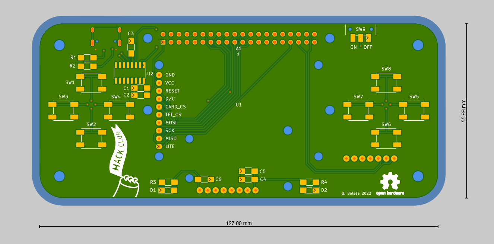
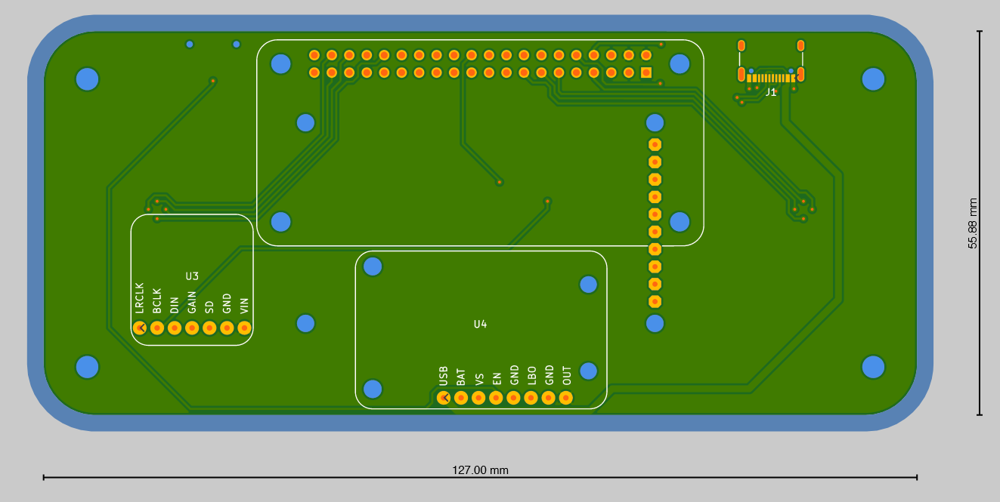

# raspi-game

Raspberry pi zero W based game console with:

- 3.7 Li-ion battery (+ buck/boost module)
- speaker (+ I2S module)
- D-pad and ABXY buttons
- 1.8" TFT screen
- type C USB for charging + serial port (CH340C)

## Front

## Back

